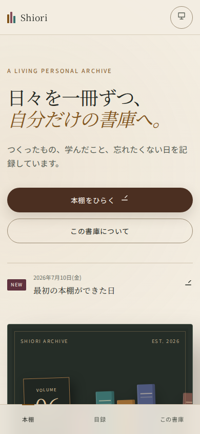
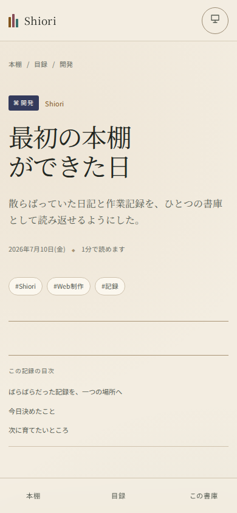

# Shiori

日記、完了タスク、学習記録、開発ログを、育っていく「本棚」として読むための静的サイトです。

MarkdownをGitHubへ置くだけ。データベース、外部CMS、APIキー、環境変数は必要ありません。リポジトリを複製してCloudflare Pagesへつなげれば、最初のデプロイからサンプル入りの完成した書庫が開きます。

> [!IMPORTANT]
> このサイトと記録は、初期状態ではインターネットへ公開されます。秘密鍵、パスワード、住所、正確な行動予定、健康・金融情報、第三者を特定できる情報、公開の同意がない画像を記録しないでください。公開リポジトリのForkは必ず公開になります。GitHub上の記録も非公開にしたい場合は、下記の「非公開にする場合」を利用してください（Cloudflareで公開したサイト自体は、別途アクセス制限を設定しない限り公開です）。

## 5分で公開する

### 1. 自分のGitHubへ複製

このリポジトリ上部の **Fork** → **Create a new fork** を選びます。リポジトリ名は自由です。公開サイトとして始める最短の方法です。

<details>
<summary><strong>GitHub上の記録を非公開にする場合</strong></summary>

[GitHub Importer](https://github.com/new/import) を開き、clone URLへ `https://github.com/birdrock621-max/Shiori.git` を入力します。所有者と新しいリポジトリ名を決め、**Private** を選んでImportします。ソースとcommit履歴が独立した非公開リポジトリへ複製されます。

リポジトリに **Use this template** が表示される場合は、そちらから **Create a new repository** → **Private** を選ぶ方法でも構いません。

</details>

### 2. Cloudflare Pagesへ接続

[Cloudflare dashboard](https://dash.cloudflare.com/) で **Workers & Pages** → **Create application** → **Pages** → **Connect to Git** を開き、複製したリポジトリを選びます。

| 設定 | 入力する値 |
| --- | --- |
| Production branch | `main` |
| Framework preset | `Astro`（選べる場合） |
| Build command | `npm run build` |
| Build output directory | `dist` |
| Root directory | 空欄 |
| Environment variables | なし |

**Save and Deploy** を押せば完了です。以降は`main`へのpushをCloudflare Pagesが検知し、自動で再ビルド・公開します。

### 3. 自分の書庫へ変更

まず [`src/site.config.ts`](src/site.config.ts) の名前、紹介文、開始年を変更します。すべて初期値のままでもサイトは動きます。

```ts
export const siteConfig = {
  name: 'Shiori',
  owner: '書庫の持ち主',
  description: '日々の出来事と、小さな達成を収める私の書庫。',
  // ...
}
```

GitHubの画面だけで変更する場合は、このファイルを開き、鉛筆アイコンの **Edit this file** から編集します。**Commit changes** を押すと、Cloudflare Pagesが自動で表示を更新します。

## 実際の画面


<p align="center">
  
  &nbsp;&nbsp;
  
</p>

## できること

- 種類・本文量・日付から形が少しずつ変わる、本棚型の記録一覧
- キーワード、年、種類、タグ、プロジェクトの複合検索
- 本棚表示と読みやすい一覧表示の切り替え
- 長文、画像、表、コード、引用、チェックリストに対応した本文ページ
- 完了タスクの集計と、記録ごとの進捗表示
- 明るいテーマ、暗いテーマ、端末設定への追従
- スマートフォン専用の横長背表紙と下部ナビゲーション
- キーボード操作、明瞭なフォーカス、動きの低減、印刷表示
- `draft: true` による生成サイトからの除外（公開GitHubリポジトリではMarkdown自体を閲覧できます）
- 0件から数百件まで、データベースなしで静的生成

## AIエージェントへ記録を頼む

リポジトリを読み書きできるChatGPT、Codex、Claude Codeなどへ、短く報告します。エージェントはルートの [`AGENTS.md`](AGENTS.md) を読み、保存場所、形式、安全確認、検証方法を判断できます。

依頼例：

```text
今日は検索画面を完成させた。工夫した点と完了タスクを、Shioriの開発記録に追加して。
```

```text
授業で学んだ内容を今日の学習記録にして。タグは世界史と復習。
```

```text
今日の日記に、夕方に散歩したことを追記して。個人を特定できる情報は入れないで。
```

AIが自動でpushできるのは、そのエージェントに対象リポジトリへの書き込み権限があり、利用環境でpushが許可されている場合だけです。権限がない場合は、作成された変更をGitHub Desktopなどから手動でcommit・pushしてください。

## 手動で記録を追加する

### GitHubの画面だけで追加する

1. 自分のShioriリポジトリをGitHubで開き、**Add file** → **Create new file** を選びます。
2. ファイル名の欄へ、記録した日付に合わせたパスを入力します。

```text
content/records/2026/07/2026-07-11-short-english-slug.md
```

3. 次の最小構成を貼り付け、日付、題名、要約、タグ、本文を書き換えます。ファイル名の日付と `date` は必ず一致させてください。

```md
---
title: "今日の題名"
date: 2026-07-11
type: diary
summary: "一覧で内容が分かる短い要約。"
tags: [日記, 振り返り]
---

ここに本文を書きます。
```

4. **Commit changes** を押し、commitメッセージを入れて `main` へcommitします。Cloudflare Pagesの自動デプロイ後、新しい本が棚へ加わります。

使える全項目と規則は [`content/_templates/record.md`](content/_templates/record.md) と [`AGENTS.md`](AGENTS.md#記録のfront-matter仕様) にあります。

### コマンドで作成する

リポジトリを自分のPCへcloneし、`npm install` を実行済みの場合は、次のコマンドで雛形を作れます。

```bash
npm run new -- --title "今日の記録" --type diary --tags "日記,振り返り"
```

作成された `content/records/YYYY/MM/` 内のMarkdownを編集します。日付や要約もコマンドで指定できます。

```bash
npm run new -- \
  --title "検索画面を完成させた" \
  --date 2026-07-11 \
  --type development \
  --tags "Shiori,UI" \
  --project "Shiori" \
  --summary "検索と複合絞り込みを実装し、スマートフォンでも確認した。"
```

## 画像を追加する

画像は次のように記録ごとのフォルダへ置きます。

```text
public/images/records/2026/07/search-screen/screenshot.webp
```

Markdown本文では `/images/records/2026/07/search-screen/screenshot.webp` と指定します。カバー画像にする場合はfront matterへ次を追加します。

```yaml
cover: "/images/records/2026/07/search-screen/screenshot.webp"
cover_alt: "検索欄と四つの絞り込みが並ぶ画面"
```

同じパスの画像を差し替えるとキャッシュが残る場合があります。内容を変えたときは `screenshot-v2.webp` のようにファイル名も変更してください。

## サンプルを自分の記録へ置き換える

初回表示を完成形にするため、`content/records/` に6件の架空サンプルが入っています。自分の記録を追加したら、front matterに `sample: true` があるファイルを削除できます。画像サンプルを使わなくなった場合は `public/images/sample/` も削除して構いません。

記録が0件になっても、サイトは追加方法を案内する空の書庫として正常に表示されます。

## ローカルで確認する（任意）

Node.js 22.12以上を用意して、次を実行します。

```bash
npm install
npm run dev
```

公開前の一括確認：

```bash
npm run validate
```

これにより、型、記録の形式、危険な埋め込み、画像パス、単体テスト、静的ビルドを確認します。

## よくある問題

<details>
<summary><strong>Cloudflare Pagesにリポジトリが表示されない</strong></summary>

- Cloudflareと同じGitHubアカウントへログインしているか確認します。
- GitHubの **Settings** → **Applications** → **Installed GitHub Apps** からCloudflareのGitHub Appを開き、Shioriリポジトリへのアクセスを許可します。
- **Only select repositories** を使っている場合は、複製したリポジトリを追加します。
- Organization内のリポジトリは、管理者にGitHub Appの承認が必要な場合があります。
- 許可後にCloudflare dashboardへ戻り、Git連携を再読み込みします。

</details>

<details>
<summary><strong>Cloudflare Pagesのビルドに失敗する</strong></summary>

- Build commandが `npm run build` か確認します。
- Build output directoryが `dist` か確認します。
- Root directoryは空欄にします。
- Cloudflareのログで、問題のあるMarkdownファイル名を確認します。
- 手元で `npm run check` を実行すると、日付やfront matterの問題を詳しく確認できます。

</details>

<details>
<summary><strong>追加した記録が表示されない</strong></summary>

- ファイルが `content/records/YYYY/MM/` にあるか確認します。
- `draft: true` なら `false` に変更します。
- `date` とファイル名・年/月ディレクトリの日付を一致させます。
- Cloudflare Pagesの最新デプロイが成功しているか確認します。

</details>

<details>
<summary><strong>画像が表示されない</strong></summary>

- 画像を `public/images/` 以下へ置きます。
- Markdownでは `public` を含めず、`/images/...` から書きます。
- ファイル名の大文字・小文字を確認します。Cloudflare上では区別されます。

</details>

<details>
<summary><strong>誤って秘密情報をpushした</strong></summary>

本文を削除するだけではGit履歴やデプロイ済みキャッシュに残る可能性があります。まず漏れたキーやパスワードを失効・変更してください。その後、GitHubの案内に従って履歴から削除し、Cloudflareのデプロイも確認します。秘密情報そのものを公開Issueへ貼らないでください。

</details>

## 更新する

個人記録を守るため、更新前に `content/records/`、`public/images/records/`、`src/site.config.ts` をバックアップしてください。Forkを使っている場合はGitHubの **Sync fork** を利用できますが、個人記録を上流へのPull Requestへ含めないでください。

詳しい手順と、独立コピーしたリポジトリの更新方法は [`docs/UPDATING.md`](docs/UPDATING.md) にあります。

## 技術構成

- [Astro](https://astro.build/) による完全静的生成
- Astro Content CollectionsによるMarkdownスキーマ検証
- サーバー、データベース、クライアントフレームワークなし
- JavaScriptは検索、表示切替、テーマ切替だけ（圧縮後約5KB）
- Cloudflare Pages向けのセキュリティヘッダーと長期キャッシュ

## OSSとして使う・改造する

MIT Licenseです。個人利用、商用利用、改造、再配布ができます。改善提案やPull Requestは歓迎します。

- 貢献方法: [`CONTRIBUTING.md`](CONTRIBUTING.md)
- セキュリティ: [`SECURITY.md`](SECURITY.md)
- 変更履歴: [`CHANGELOG.md`](CHANGELOG.md)
- ライセンス: [`LICENSE`](LICENSE)

個人の記録・画像・設定は上流へのPull Requestへ含めず、再現に必要な架空データだけを使ってください。
